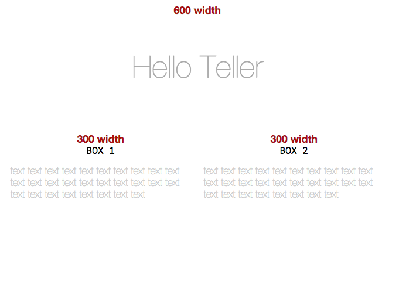
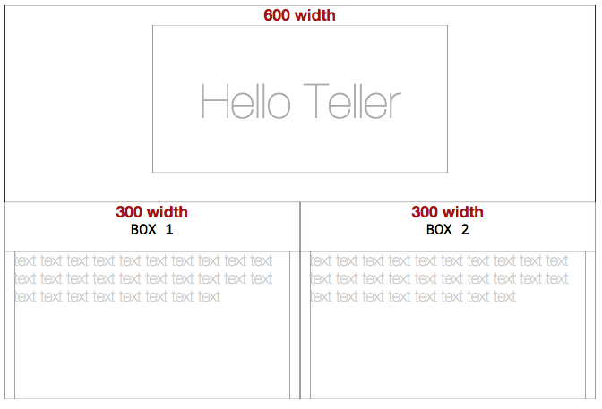

# teller
Teller makes div borders visible without offsets for itself.
 (Improved *border: 1px solid #000000;* like grid system debugging.)

Giving margins in css grid system is a basic method to create beautiful UIs, but multiple div often goes to mess. Teller makes div borders visible for graspable grid system. Unlike convensional border visualization with border attributes of div tag, teller does'nt require pixels for itself. Teller attaches bordered image on the background image instead.

```css
<link href="teller.css" rel="stylesheet" type="text/css">
```

* * *

  Teller off



  Teller on


(Note that *border: 1px solid #000000;* like grid system debugging does require pixels for borders.)